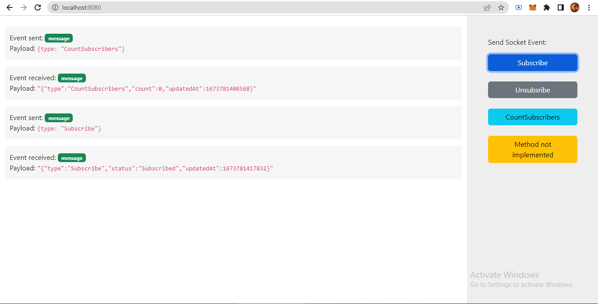

## About The Project

This is a test app built using Node.js. The app involves simple back and forth communication between a server and a client using websocket (socket.io).

## Getting Started

### Prerequisites

Must have Node.js v16 or above, the app is built on Node v16.16.0

### Installation

Please follow the steps below to run the app:

1.  Clone the repo
    ```sh
   git clone https://github.com/muzammilversiani/b2broker-test.git
   ```
2.  Install NPM packages
   ```sh
   npm install
   ```

### Run

Use the following command to run the app:
```sh
npm run dev
```

The command will start a development server at port 8080. You can now access the client by browsing http://localhost:8080 in your browser.

<div style="margin-top: 10px; margin-bottom: 10px;">
    
</div>

### Test

To run the tests, please make sure to start the development server first and then run the following command:
```sh
npm run test
```